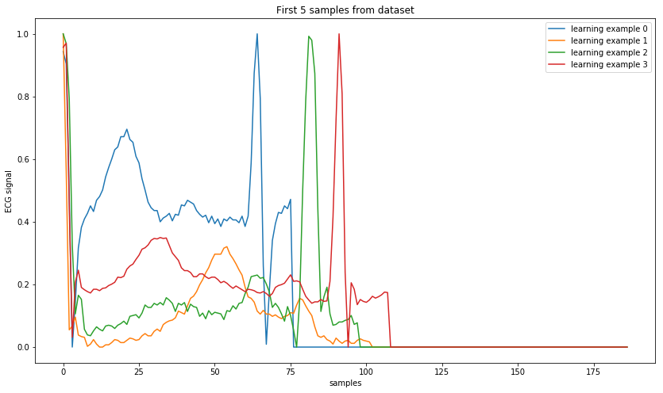
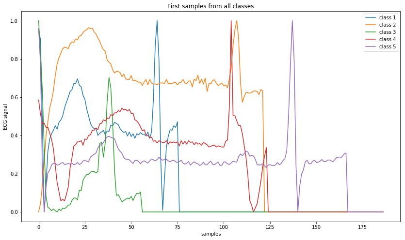
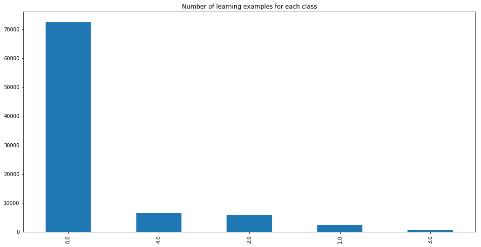

# Imbalance reduction techniques applied to the ECG classification problem

Code with models used for experiments in paper *Imbalance reduction techniques applied to ECG classification
problem* submitted to the Special Session of IDEAL conference: *Machine Learning Algorithms for Hard Problems*.

## Repo organisation

The repository is organised as follows:

1. Residual Network used as a baseline for experiments can be found in [base_model.py](base_model.py)
2. Multiclass UMCE code can be found in [ensamble](ensamble) directory
2. Used oversampling methods are in [oversampling](oversampling) folder
3. Code used for experiments are the files in the main directory with '_experiment' suffix
4. Value of metrics for all folds and the code for statistical tests can be found in the [results](results) folder
5. Directories: [dataset_utils](dataset_utils), [experiment_utils](experiment_utils), [utils](utils) contain code used in main parts

## ECG imbalance problem

The dataset used for this study was [MIT-BIH](https://www.kaggle.com/shayanfazeli/heartbeat) from kaggle. ECG signals there are normalised to fit [0,1] interval and padded with zeros to 187 samples length. Here are some examples of how these singlas look like:

In this dataset there are 5 classes ('N': 0, 'S': 1, 'V': 2, 'F': 3, 'Q': 4). They are identfied with certain groups of arrhythmia entities. As often in case of medical datasets MIT-BIH is heavily imbalanced.

| Label  | Number of learning examples|Imbalance ratio|
| ------ |:--------------------------:|:-------------:|
| 0      | 72470                      | -             |
| 1      | 2223                       | 32.6 : 1      |
| 2      | 5788                       | 12.52 : 1     |
| 3      | 641                        | 113.06 : 1    |
| 4      | 6431                       | 11.27 : 1     |

In our work we explore the impact of the traditional imbalance reduction techniques on the performance of deep learning models.
